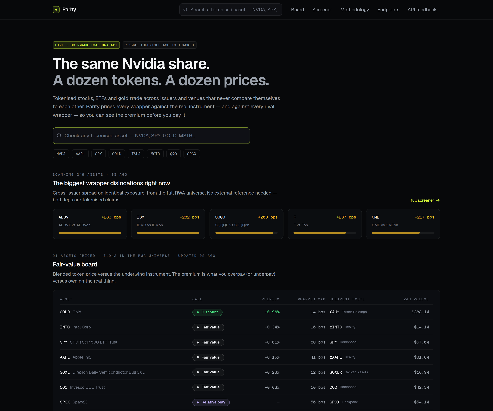
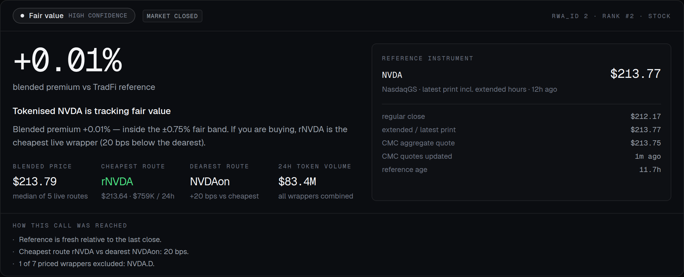
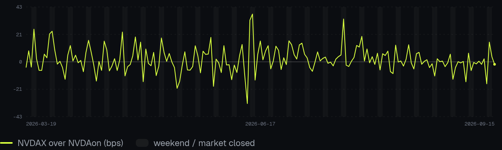
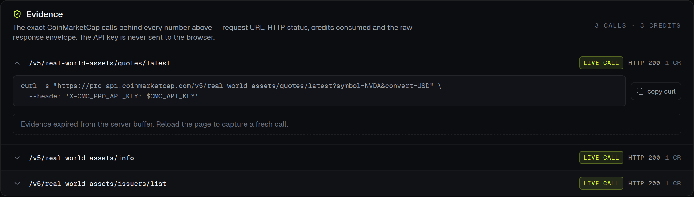

# Parity — the fair-price check for tokenised stocks

**Live app: [parity-xi.vercel.app](https://parity-xi.vercel.app)** · **Demo video: [YouTube link — add after upload]** · **X post: [link — add after posting]**

**Track: Real World Assets** (Build with CMC: API Hackathon)

> Tokenised Nvidia trades as `NVDAX`, `NVDAon`, `NVDAB`, `rNVDA`, and four more wrappers — each with its own price, liquidity and issuer. Parity measures every wrapper against the real instrument and against every rival wrapper, so you can see the premium before you pay it.



---

## The problem (measured, not assumed)

A tokenised share is the same economic claim sold through different issuers. The wrapper — not the asset — sets the price, and nothing on the market compares them:

| Observed dislocation | Source |
| --- | --- |
| A tokenised AAPL traded at a **+14.92% premium** with **$195 of depth** before 2% slippage | Ondo public post-mortem of early tokenised equities |
| The same SpaceX share priced **$122 → $176** across venues within ~10 days of listing | CMC Research, *Tokenized Stocks: The Venue Landscape* |
| `NVDAon` traded **+8.83% above the underlying** on 6 Sep 2025 while `NVDAX` sat in line | Parity's own history engine, shown in-app |
| `SPYon` priced **+83 bps above the cheapest SPY wrapper** at the time of writing | Parity live board |

Every one of these is a real cost to a buyer, and every one is invisible on an issuer's own dashboard.

## What Parity does

1. **Prices the asset** — blended token price versus the underlying's own last print, with the session and its age always shown.
2. **Ranks every wrapper** — cheapest to dearest, with unit normalisation, liquidity gating and outlier detection. Excluded venues stay visible **with the reason attached**.
3. **Proves the history** — 180 sessions of drift-free cross-wrapper spread plus premium-versus-underlying, with weekend/holiday bands shaded. The RWA API has no history endpoint yet, so Parity reconstructs it from token OHLCV joined against the underlying.
4. **Alerts on your thresholds** — evaluated server-side against live data on every page load; the watchlist lives in your browser, so there are no accounts and no database.
5. **Shows its work** — every verdict links to the raw CoinMarketCap call behind it: endpoint, HTTP status, credits burned, full JSON payload.

| Wrapper verdict | Dislocation history | Evidence drawer |
| --- | --- | --- |
|  |  |  |

## Visible evidence of a real API call

Request (the key is supplied via header and never committed):

```bash
curl -s "https://pro-api.coinmarketcap.com/v5/real-world-assets/quotes/latest?symbol=NVDA&convert=USD" \
  --header "X-CMC_PRO_API_KEY: $CMC_API_KEY"
```

Trimmed live response — note `tokens[]`: each wrapper carries its own price, volume and issuer, which is what makes cross-issuer comparison possible:

```json
{
  "data": {
    "rwa_assets": [{
      "name": "Nvidia Corp",
      "symbol": "NVDA",
      "rwa_id": 2,
      "asset_type": "stock",
      "average_tokenized_price": 213.7948,
      "tokenized_volume_24h": 83823811.7,
      "tokens": [
        { "symbol": "NVDAX",  "crypto_id": 36992, "price": 214.036, "volume_24h": 12932112.23, "issuer_name": "Backed Assets" },
        { "symbol": "NVDA.D", "crypto_id": 28616, "price": null,    "volume_24h": null,        "issuer_name": "Dinari Assets" },
        { "symbol": "NVDAon", "crypto_id": 38093, "price": 214.040, "volume_24h": 2410487.34,  "issuer_name": "Ondo Assets" }
      ]
    }]
  },
  "status": { "timestamp": "2026-09-16T07:41:31.545Z", "error_code": "0", "credit_count": 1 }
}
```

The same request/response pair is inspectable in the running app via the evidence drawer on any asset page (`/asset/NVDA`).

## Endpoints used

| Endpoint | What it contributes | Cost |
| --- | --- | --- |
| `/v5/real-world-assets/quotes/latest` | **Core call.** Every wrapper's own price, volume, market cap and issuer, plus CMC's blended tokenized quote | 1 credit / 250 assets |
| `/v5/real-world-assets/assets/list` | The investable universe (~7,940 assets) ranked by tokenized volume | 1 credit / 250 assets |
| `/v5/real-world-assets/map` | Stable `rwa_id` resolution for search and evidence pinning | free |
| `/v5/real-world-assets/info` | Industry, employees, founding date, SEC CIK, description | 1 credit / 250 assets |
| `/v5/real-world-assets/issuers/list` | Issuer lineage behind each wrapper (Backed, Ondo, bStocks, Paxos…) | 1 credit / request |
| `/v2/cryptocurrency/ohlcv/historical` | Daily wrapper closes → premium and spread history | 1 credit / ~100 points |

A full-universe dislocation scan costs **2 credits**. See `/endpoints` in the app for the live call log.

## What the API made possible — and where it got in the way

The per-issuer split in `quotes/latest` is the single design decision that makes Parity possible; a whole-universe screener for two credits is remarkable value. Seven specific frictions are documented in-app at **`/feedback`**, with reproductions:

1. `market-pairs/list` is documented for Startup but returns `error_code 1006` on the hackathon key — the one endpoint that would add per-venue depth.
2. OHLCV `historical` returns exactly 10 points when `time_start` is used without `count` — a range query that behaves like a paginated one.
3. No RWA historical series yet (the academy article calls it "planned") — every builder must reconstruct premium history themselves.
4. No session alignment: RWA candles close 23:59:59 UTC while US equities close 20:00/21:00 UTC, so naive comparison bakes after-hours drift into "premium".
5. No unit metadata on commodities — gold is quoted per troy ounce *and* per gram in the same family.
6. Zero-volume venues still carry prices (one was 85% away from the market) with nothing to distinguish them from live ones.
7. Derivatives and wrapped tokens sit in the same `tokens[]` array as primary issuance; a `token_class` field would remove the string-matching.

## How the verdict works

Eligibility pipeline, in order: **presence → unit → liquidity → outlier**, then verdict maths on what survives.

- `blended_price = median(included wrapper prices)` — median, so one bad venue cannot move the headline
- `premium % = (blended_price / reference_price − 1) × 100`
- `wrapper_spread_bps = (dearest / cheapest − 1) × 10,000` — cheapest must clear a volume bar scaled to market size
- Verdicts: `OVERPRICED` (> +0.75%), `DISCOUNT` (< −0.75%), `FAIR` (±0.75%), `DISPERSION` (cross-wrapper stdev > 1.5%), `ILLIQUID` (< $50K volume), `RELATIVE` (no mapped reference)
- Per-gram metal quotes are normalised ×31.1035; anything with a genuinely different unit is excluded and explained rather than reported as a fake discount
- Reference prices come from public exchange endpoints with a second provider as failover, always labelled with session and age; futures/ADR/leveraged references cap confidence

Full detail: **`/methodology`** in the app. The engine is a pure function with 18 unit tests covering unit mismatches, dead venues, outlier rejection, staleness and every verdict branch.

## Stack and security

- **Next.js 16 (App Router) + TypeScript + Tailwind**, no chart library and no client data fetching for prices
- All CoinMarketCap calls happen **server-side** through one client that handles caching (per-endpoint TTLs that respect CMC's own refresh cadence), retry with backoff, in-flight de-duplication, and evidence capture
- **The API key never leaves the server**: not in client bundles, logs, cache, evidence records or the repo. Evidence stores the URL plus a curl that reads `$CMC_API_KEY` from the environment, and `.env*` is gitignored and `.vercelignore`d
- Rate-limit aware: a request gate caps concurrent reference fetches at 2 with 250ms spacing, so bursts never trip provider throttling

## Run it locally

```bash
pnpm install
cp .env.example .env.local      # add your CMC Pro API key
pnpm dev                        # http://localhost:3000
pnpm test                       # verdict engine unit tests
pnpm lint && npx tsc --noEmit   # checks
```

Get a free key at [coinmarketcap.com/api](https://coinmarketcap.com/api) — the RWA endpoints are available from the Basic plan.

Optional scripts:

```bash
BASE_URL=https://parity-xi.vercel.app node scripts/record-demo.mjs          # re-record the demo video
BASE_URL=https://parity-xi.vercel.app node scripts/capture-screenshots.mjs  # refresh README shots
BASE_URL=https://parity-xi.vercel.app node scripts/capture-share-card.mjs   # export a share card
```

## Known limitations (stated, not hidden)

- **Total-return wrappers drift by design.** Ondo tokens reinvest dividends into the token, so they accrue a small premium versus the raw ticker. Premium-versus-reference therefore mixes wrapper price with accrued yield — which is exactly why the drift-free wrapper-against-wrapper chart leads.
- **Reference prices are not from CoinMarketCap.** The RWA API does not expose the underlying instrument's own quote, so Parity uses public exchange endpoints with failover; when both fail it degrades to relative mode instead of guessing.
- **History starts when CMC's OHLCV coverage starts**, not at token launch.
- **Venue depth stops at issuer level** while `market-pairs` is unreachable on this plan.

## Submission notes

- Track: **Real World Assets**
- Deployed: **https://parity-xi.vercel.app**
- Demo video: **[add YouTube/X link]**
- X post: **[add link with #BuildwithCMC]**
- API feedback: `/feedback` (seven reproducible findings)

Built for the Build with CMC: API Hackathon. Market data © CoinMarketCap. Not investment advice.
